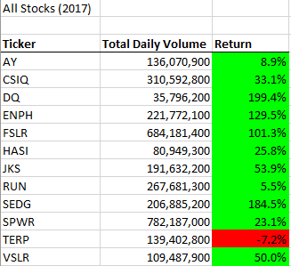
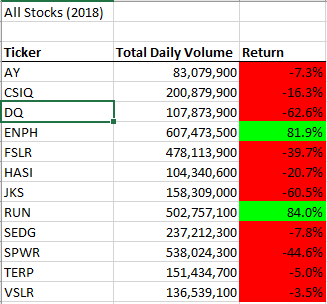
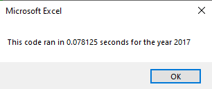
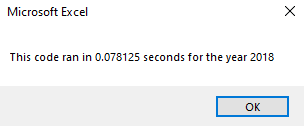

# VBA Challenge – Written Analysis of Results

## Overview of Project

### Purpose: 
The purpose of this project is to assist Steve with analyzing the entire stock market over a few years. This analysis will allow Steve to determine the most viable stocks for his parents to invest in. The previous DQ analysis script was refactored and used to analyze over 3000 stock market transactions This may assist with making wise investment decisions. In addition, the refactoring also would help measure the performance of the script using the stock market data set for 2017 & 2018.

## Results: 
The scripts helped us to determine the stock volume traded in the stock market in 2017 and 2018 using the 12 stock market tickers and their performance for both years. The analysis of the 12 stock tickers shows that the SPWR stock had the highest trade volume of over 782 million stocks in 2017 followed by FSLR and CSIQ respectively. Although these stocks traded the most, DQ and SEDG had the highest return on investment with 199.9% and 184.5%, respectively. TERP suffered a 7.2% loss for the year.

 
For the following year 2018, stock performance dropped compared to 2017. The RUN and ENPH stocks performed the best with 84.0% and 81.9% returns respectively. However, high trade volume may not have positively contributed to their gain as SPWR with 2nd largest trade had a 44.6% decline in returns. The DQ stock which Steve was interested in saw a steep descent with the largest of all stock losses at 62.6% loss.

 

To arrive at this analysis, we created an array of the ticker index set up in a VBA loop. Using the For loop and arrays, we iterated the ticker index from zero to 11 for the 12 different tickers. We also used conditional statements to run through the loops to determine the volume and the returns.

 e.g. If Cells(i, 1).Value = tickers(tickerIndex) And Cells(i + 1, 1).Value <> tickers(tickerIndex) Then tickerIndex = tickerIndex + 1

We also determine the run time using the script

endTime = Timer
	MsgBox "This code ran in " & (endTime - startTime) & " seconds for the year " & (yearValue)
 

### Summary: 
By using the DQ Analysis code, we were able to refactor the same code for use in the VBA Challenge project. A benefit of refactoring an original code for use in another ensures a quick turnaround for software development, reduces costs, and ensures a consistent standard for development. Reusing codes could also be a problem especially when only part of an old code is reused. It sometimes gives errors and may not align with the rest of the script.

With the VBA script, refactoring the DQ analysis code for the VBA Challenge gave a shorter run time than it previously did. This is because, for the 2nd run, the system already used the code for the 1st time but responds much more quickly when it is rerun with some modification. However, the refactored VBA script had more conditional formatting which posed gave some errors before it finally passed successfully.
